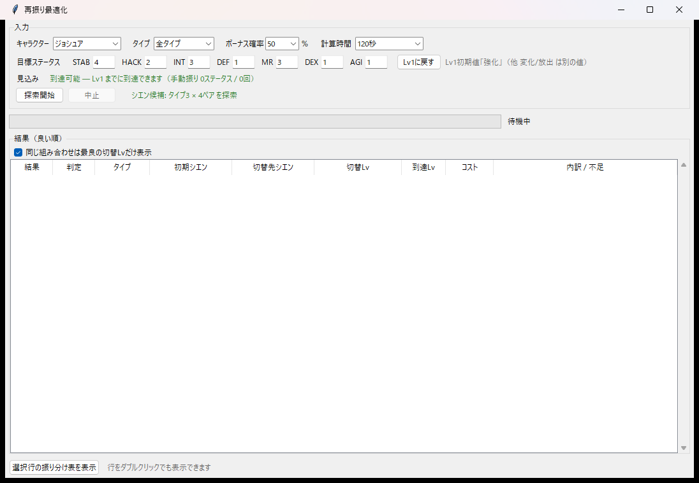

# TW 再振り最適化ツール

テイルズウィーバーの「再振り」を最適化するツールです。
**キャラクターと目標ステータスを入れるだけ**で、タイプ・初期シエン・切替先シエン・
切替レベルの全組み合わせを探索し、目標に最も早く到達する振り方を求めます。

結果は[俺シミュ](https://www.google.com/search?q=%E4%BF%BA%E3%82%B7%E3%83%9F%E3%83%A5+%E5%86%8D%E6%8C%AF%E3%82%8A)形式の
振り分け表で出力でき、シミュレータにそのまま貼り付けて読み込ませられます。



## 使い方

```
python gui.py
```

または `gui.bat` をダブルクリック。exe 版なら `TwSaifuri.exe`。

1. キャラクターを選ぶ（Lv1初期値が自動で入ります）
2. 目標ステータスを入力する
3. 入力欄の下の「見込み」に到達可能かが出ます
4. 「探索開始」で全組み合わせを探索
5. 結果の行をダブルクリックすると振り分け表が別ウィンドウで開きます

### 見込み表示

入力中に、その目標が到達可能かを二段階で判定します。

| 表示 | 意味 |
|---|---|
| 到達可能 | 貪欲法で実際に到達できた（実行可能な手順が存在する証明） |
| 到達可能（確定） | 有望な候補を厳密計算して到達を確認 |
| 届く可能性は低いです | 上位数件を厳密計算しても不足。全候補は試していない |

### 計算時間

「無制限（推測なし）」を選ぶと、枝刈りを通った候補を**すべて厳密計算**します。
推測値は一切出ません。目標によっては数時間かかるので、開始数秒後に出る
所要時間の見積り（実測で補正されます）を見て判断してください。途中で中止できます。

## 仕組み

ステータスを 1 上げるのに必要なポイントは次の式で決まります。

```
必要ポイント = 初期コスト[stat] + floor((現在のステ値 * 5 + 現在のLv) / 125)
```

係数 5 はゲーム内実測（Lv75 と Lv145 の全7ステータス、14点）で確定させています。
`calibrate.py` で再確認できます。

```
python calibrate.py ベンヤ 霊魂 HACK 284:140:8 180:60:4
```

### 探索

素朴にやると k 次元格子（Δの総積）を全部持つことになり、5ステータスで約 5 億セル
＝ 2GB を超えます。本ツールは次の 2 点で畳んでいます。

- **レベルはコストの純関数**なので、セルに持つ値はコスト 1 本で足りる
- 遷移は必ず Σm を +1 するので、**必要なのは直前の反対角線レイヤー 1 枚だけ**

結果、5 億セルの問題が 25MB で解けます（近似ではなく厳密に同じ答え）。
さらに numba で並列化し、生存セルだけを走査することで、numpy 実装の約 80 倍
（425秒 → 5秒）で動きます。

探索全体は三段構えです。

1. **列挙 + 下界枝刈り** — O(1)/件
2. **貪欲法スクリーニング** — 数十μs/件。順位づけ用の推定値
3. **厳密 DP** — 上位のみ確定させる

貪欲法は最適から最大 14% ずれるため、「達成」と言い切るのは 3 を通ったものだけです。

### メモリ

作業配列は実行環境の空きメモリとコミット残から自動で決まります。収まらない場合は
一時ファイルに退避して計算します（遅くなりますが計算はできます）。

## ファイル

| ファイル | 役割 |
|---|---|
| `gui.py` | GUI 本体。`--selftest` で自己診断 |
| `search.py` | タイプ・シエン・切替レベルの探索 |
| `solver_fast.py` | 厳密 DP ソルバ（numba） |
| `format_plan.py` | 振り分け表の生成 |
| `replay_plan.py` | 振り分け表を読み戻して検証する |
| `calibrate.py` | コスト式の係数をゲーム内実測から求める |
| `character_parameter.py` | キャラ初期値・シエン・ボーナステーブル |
| `xien_availability.py` | キャラごとに取れるシエンの一覧 |

## exe をビルドする

```
build_exe.bat
```

`dist\TwSaifuri\` に出ます（約 195MB。numba と llvmlite を同梱するため）。
ビルド後に自己診断が自動で走ります。

## 動作確認

- ソルバの答えは総当たり DP と 12 ケースで照合済み（経路復元込み）
- モデル全体（初期値・シエン自動上昇・乱数ボーナス表・レベル毎ポイント・コスト式）を
  ゲーム内スクリーンショットと突き合わせて一致を確認
- 振り分け表は `replay_plan.py` で読み戻し、元の計画と一致することを検証

## 注意

- ゲーム内データ（キャラ初期値・シエンの上昇ステータス等）は実機から採取した値です。
  ゲーム側の更新で変わる可能性があります。
- `xien_availability.py` のシエン候補は手で埋めたものです。誤りに気づいたら
  修正してください。空にすると全ペア総当たりにフォールバックします。
- 本ツールは非公式のファンツールで、ゲーム運営とは無関係です。

## ライセンス

MIT License
